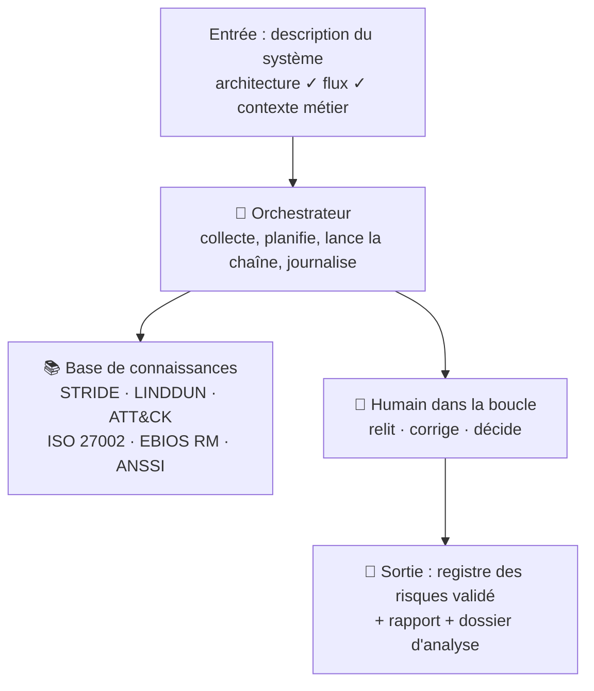
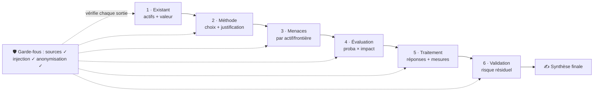
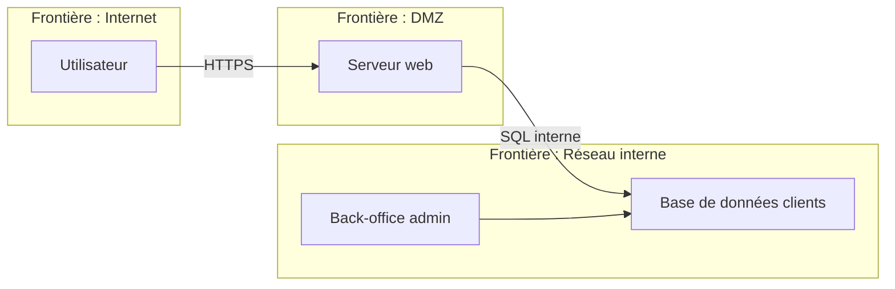
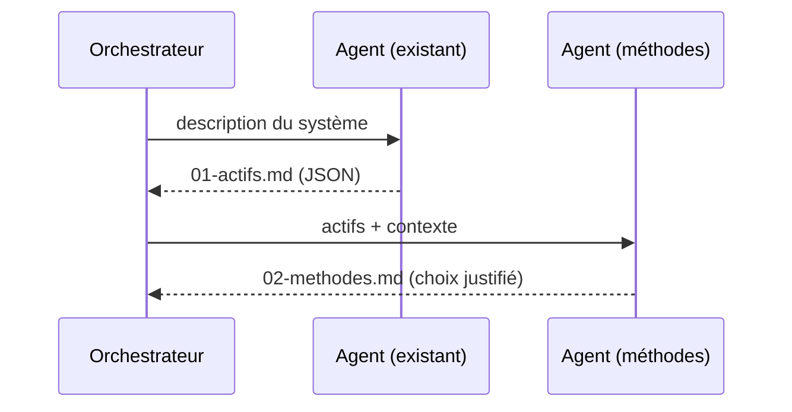

# Schémas & diagrammes (Mermaid)

Toute documentation contient des schémas **rendus en Mermaid** (compatibles GitHub/markdown). Convention de style : **cohérent, lisible, français**, couleurs douces par rôle.

## 1. Architecture globale (flowchart)

## 2. Chaîne d'agents (6 étapes)

## 3. DFD + frontières de confiance

## 4. Échanges entre agents (sequenceDiagram)

## Règles

- Un schéma doit illustrer UNE idée ; les diagrammes riches référencent les composants (agents, base de connaissances, garde-fous).
- Mentionner systématiquement les **garde-fous** et la **validation humaine** dans les schémas.