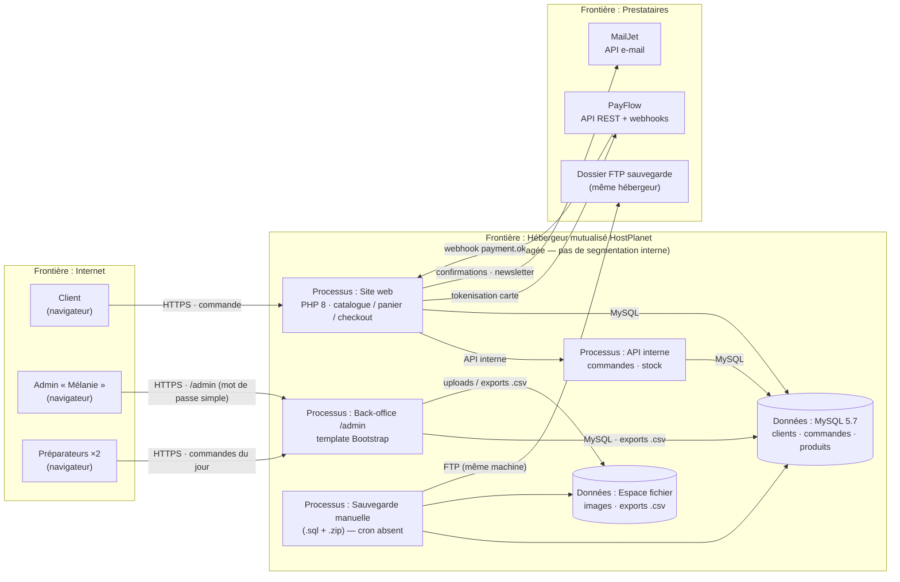

# Étape 1 — Description de l'existant : cas pilote « ShoPix »

> Produit par la chaîne E21 (étape 1 · identifier les actifs) — entrée : `etude-de-cas.md` (cas A pilote).

## 1. Cas étudié

**ShoPix** est une petite boutique en ligne (TPE) qui vend des produits imprimés (posters, t-shirts, goodies) sur commande. Créée en 2021, elle réalise ~15 000 € de CA par trimestre, traite ~60 commandes/semaine en moyenne, avec un pic à ×3 en période de fêtes (novembre–décembre).

**Finalité de l'analyse** : livrer un registre des risques priorisé (actifs, menaces, niveaux, contre-mesures) pour **justifier un budget sécurité (~2 500 €/an)** auprès du dirigeant, puis proposer un plan de remédiation par ordre de priorité.

## 2. Périmètre

| | |
|---|---|
| **Inclus** | Site web public, back-office, base de données, flux paiement côté boutique, e-mails, sauvegardes, comptes admin |
| **Exclus** (frontières de confiance tracées) | Infrastructure PayFlow, MailJet, hébergeur (côté fournisseurs), postes clients |

## 3. Acteurs et rôles

| Rôle | Droits | Moyen d'accès |
|---|---|---|
| Client | Commande, suivi, désinscription newsletter | compte optionnel (e-mail + mot de passe) |
| Admin « Mélanie » | Tout (produits, commandes, clients, exports) | mot de passe simple, **pas de MFA**, sessions 30 j |
| Préparateur ×2 | Commandes du jour, marquer « expédiée » | comptes dédiés, mot de passe simple |
| PayFlow | Webhooks « payment.ok » | clé API dans `.env` |
| MailJet | Envoi e-mails (confirmations, newsletters) | clé API dans `.env` |

## 4. Architecture et flux (DFD + frontières de confiance)

### Frontières de confiance identifiées

| # | Frontière | Éléments | Points d'attention |
|---|---|---|---|
| F1 | **Internet → HostPlanet** | Clients, admin, préparateurs → site / back-office | Expositions HTTPS ; brute force `/admin` observée (2024) |
| F2 | **HostPlanet → Prestataires** | PayFlow (webhooks), MailJet, FTP sauvegarde | Dépendance aux clés API ; clés stockées en clair dans `.env` |
| F3 | **HostPlanet interne** (pas de frontière réelle) | Site = API = back-office = MySQL = fichiers sur la **même VM** | Aucune segmentation : compromission d'un composant = compromission de tous |
| F4 | **Mutualisation hébergeur** | Autres clients sur la même machine | Isolation PHP « non vérifiable » |

## 5. Contexte métier et contraintes

- **RGPD** : données personnelles **OUI** (`donnees_personnelles: true`) — données clients européennes ; pas de DPO, registre absent, mentions légales incomplètes, droit à l'oubli non automatisé.
- **PCI DSS** : cartes **jamais stockées** (tokenisation PayFlow) hors périmètre serveur ; mais checkout avec pages de paiement embarquées.
- **Contraintes hébergeur** : mutualisé, pas de root, pare-feu non configurable, PHP maintenue par l'hébergeur.
- **Budget** : ~2 500 €/an à justifier — impératif de rester concurrentiel côté prix.
- **Règles affaires** : disponibilité critique en décembre (perte de CA directe) ; conformité RGPD = exigence réglementaire ; réputation fragile.

## 6. Champ de décision pour les étapes suivantes

- `donnees_personnelles` : **true** → la prudence impose d'examiner la vie privée (LINDDUN) en complément de STRIDE.
- Méthode par défaut : **STRIDE** (application web décrite par DFD) — à justifier à l'étape 2.