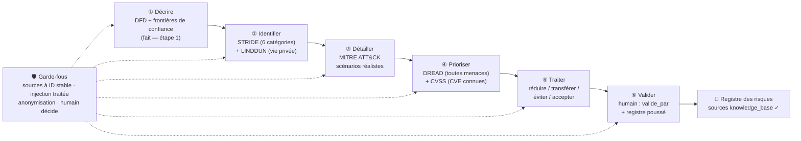

# Étape 2 — Choix de la méthode de modélisation des menaces (cas ShoPix)

> Produit par la chaîne E21 (étape 2 · choisir une méthode et la **justifier**).
> Entrées : `etude-de-cas.md`, `00-description.md`, `01-actifs.md`, `knowledge_base/README.md`.
> Statut : proposition — **validation humaine requise** avant de lancer l'étape 3.

---

## 1. Point de départ : ce que le cas impose

Rappel des caractéristiques du cas qui **conditionnent** le choix (issues des entrées) :

| Caractéristique | Valeur (cas) | Conséquence sur le choix |
|---|---|---|
| Type de système | Application web simple (PHP 8, front HTML/CSS/JS, API interne, MySQL 5.7) sur **hébergement mutualisé** | Modélisable par DFD — déjà produit à l'étape 1 (`00-description.md`, 4 frontières F1–F4) |
| Données personnelles | **OUI** (`donnees_personnelles: true`) — A-05, A-06, A-11, RGPD applicable | Vie privée à traiter → complément **LINDDUN** |
| Organisation | TPE, **pas d'équipe sécurité**, budget à justifier ~2 500 €/an | Pas de méthode lourde (ni EBIOS RM ni PASTA complets) |
| Exigence réglementaire | **RGPD** (pas d'exigence ANSSI, pas OIV/administration) | EBIOS RM non requis ; LINDDUN pertinente |
| Incidents passés documentés | 2023 clé MailJet piratée · 2024 brute force `/admin` · 2025 perte 2 j de commandes · clé PayFlow versionnée sur GitHub | Scénarios réalistes à ancrer : **MITRE ATT&CK** pour les détailler |
| Vulnérabilités connues | PayFlow-SDK 2.1 (**CVE-2023-XXXX non patchée**) · PHP 8.0 EOL · MySQL 5.7 · `composer audit` jamais lancé | Noter les CVE : **CVSS v4.0** |
| Objectif de l'analyse | Registre des risques **priorisé** (8–10 risques) pour un plan de remédiation ordonné | Besoin d'une grille de **priorisation** : **DREAD** |

---

## 2. Tableau comparatif des méthodes

Sources : voir section 5 (ID de `knowledge_base/README.md`).

| Méthode | Point de départ | Effort | Idéal pour | Quand choisir |
|---|---|---|---|---|
| **STRIDE** (`STRIDE-S`…`STRIDE-E`) | DFD du système + frontières de confiance | Faible à moyen — 6 questions posées à chaque élément du DFD | Application/système décrit par DFD, dès la conception ; couvre CIA + authenticité + non-répudiation + autorisation | Système applicatif simple, modélisé en DFD, sans équipe sécurité dédiée — **le cas ShoPix** |
| **EBIOS RM** (`EBIOS-RM-2018`) | Ateliers (cadrage, sources de risque, scénarios stratégiques/opérationnels, traitement) | Élevé — 5 ateliers, équipe pluridisciplinaire | Analyses au niveau **organisation** ; administrations, OIV, exigence ANSSI | Organisation soumise à l'ANSSI ou système imbriqué dans un écosystème large — **pas le cas** (TPE, aucunement OIV) |
| **LINDDUN** (`LINDDUN-L`…`LINDDUN-NC`) | Flux de données personnelles + consentement | Moyen — 7 catégories « vie privée » | Traitements de données personnelles, conformité RGPD | `donnees_personnelles: true` → **complément indispensable de STRIDE** dans ce cas (A-05, A-06, A-11) |
| **PASTA** (`PASTA-*`) | Objectifs métier → intelligence de menaces → simulation d'attaques | Élevé — 7 étapes, centré « attaquant + métier » | Direction qui décide en termes métier ; scénarios simulés | Grande organisation ou projet critique avec budget/équipe dédiés — **trop lourd** pour une TPE à 2 500 €/an |
| **MITRE ATT&CK** (`ATT&CK-T1190`) | Catalogues de techniques réelles observées (tactiques → techniques) | Moyen — recherche par technique | Étayer des scénarios réalistes ; red team, SOC, mesure de couverture | En **complément** : détailler concrètement les scénarios issus de STRIDE/LINDDUN (ex. compromission du site exposé) |
| **DREAD** (`DREAD-D…`) | Menaces **déjà identifiées** | Faible — 5 critères notés 1–10, moyenne = niveau | Trier rapidement une liste de menaces et ordonner le traitement | Priorisation générale sans CVE ; notes subjectives mais documentées — **adapté TPE** |
| **CVSS** (`CVSS-*`) | Vulnérabilité **connue** (CVE, NVD) | Faible à moyen — métriques Base + Environnement | Noter 0–10 une CVE et l'ajuster au contexte du SI | Pour les CVE du cas (PayFlow-SDK, PHP 8.0 EOL, MySQL 5.7) — **en complément** de DREAD |

---

## 3. Choix retenu et justification (par le cas)

### 3.1 Méthode principale : **STRIDE** (identification des menaces)

STRIDE n'est pas choisi « par défaut » mais **parce que le cas le rend objectivement le meilleur compromis** :

1. **Le point de départ existe déjà** : l'étape 1 a produit le DFD complet et les 4 frontières de confiance (F1 internet → hébergeur, F2 hébergeur → prestataires, F3 interne sans segmentation, F4 mutualisation). STRIDE s'applique directement élément par élément (acteurs, processus, stockages, flux) sans remodéliser — coût ≈ zéro.
2. **Les menaces du cas se projettent exactement sur les 6 catégories STRIDE**, comme le montrent les incidents passés et la sensibilité des actifs :
   - **S — Spoofing** : brute force `/admin` observée en 2024 (A-09, A-10 — comptes à mot de passe simple, sans MFA) ;
   - **T — Tampering** : altération des commandes/stock via API interne et MySQL (A-02, A-04) ;
   - **R — Répudiation** : exports `.csv` et actions admin sans journalisation (A-06, A-09 ; aucune journalisation centralisée) ;
   - **I — Information Disclosure** : clés API en clair dans `.env` et versionnées sur GitHub (A-08, incidents 2023/2024), exports `.csv` non pseudonymisés (A-06) ;
   - **D — Denial of Service** : indisponibilité critique en décembre (A-13), pas de monitoring/WAF/CDN, mutualisation non isolée (A-15) ;
   - **E — Elevation of Privilege** : F3 — site = API = back-office sur la même VM, aucune segmentation : une compromission du site public élève les droits sur tout (A-01, A-03, A-04).
3. **Proportionné à la TPE** : effort faible, pas d'équipe dédiée, budget 2 500 €/an — l'objectif est un registre priorisé justifiant ce budget, pas une analyse organisationnelle lourde (élimine EBIOS RM et PASTA complet, cf. § 3.3).
4. **Alignement (vérifié, non causal) avec l'énoncé du sujet** (`etude-de-cas.md` § 11) : la préconisation du sujet et les caractéristiques du cas **convergent**, mais la justification ne repose pas sur l'énoncé — elle repose sur les points 1–3 ci-dessus (DFD déjà produit, projection des menaces du cas sur les 6 catégories STRIDE, proportionnalité à la TPE). L'énoncé est une **cohérence vérifiée a posteriori**, pas un fondement (anti-circulaire).

### 3.2 Complément obligatoire : **LINDDUN** (données personnelles)

Le cas a `donnees_personnelles: true` et identifie des actifs RGPD critiques : **A-05** (données clients : nom, e-mail, adresse, tél., historique, mots de passe sha1), **A-06** (exports `.csv` complets non pseudonymisés conservés 24 mois), **A-11** (consentement newsletter mal enregistré). Ces actifs introduisent des menaces que la grille STRIDE ne couvre pas : corrélation des données (**`LINDDUN-L`**), identification d'une personne (**`LINDDUN-I`**), divulgation de données personnelles (**`LINDDUN-Disclosure`** — cas de l'export non pseudonymisé), non-conformité RGPD (**`LINDDUN-NC`** — absence de registre, droit à l'oubli non automatisé, mentions incomplètes, consentement invalide). LINDDUN s'applique **en parallèle de STRIDE** sur les seuls flux/stockages de données personnelles (A-05, A-06, A-11, flux F1–F2), pas sur tout le système.

### 3.3 Méthodes écartées — pourquoi

| Méthode | Verdict | Raison (cas) |
|---|---|---|
| EBIOS RM (`EBIOS-RM-2018`) | **Écartée** | Analyse au niveau organisation, 5 ateliers pluridisciplinaires ; ShoPix est une TPE hors OIV/administration, sans exigence ANSSI. À reconsidérer si l'analyse devait monter au niveau de l'écosystème hébergeur/prestataires |
| PASTA (`PASTA-*`) | **Écartée** | 7 étapes centrées attaquant avec simulation = sur-dimensionné pour 16 actifs et ~60 commandes/semaine ; l'essentiel (« impact métier ») est préservé via DREAD (critère *Damage*) et les règles affaires du cas |
| MITRE ATT&CK | **Complément, pas pilote** | C'est un catalogue de techniques, pas une méthode d'identification de bout en bout ; il sert à **détailler** les scénarios (étape 3) |
| DREAD / CVSS | **Priorisation, pas identification** | Les deux notent des menaces/vulnérabilités déjà connues ; aucun n'identifie de nouvelles menaces |

### 3.4 Grille de priorisation : **DREAD** + **CVSS** pour les CVE

- **DREAD** (`DREAD-D…`) : grille générale de tri des menaces identifiées (STRIDE + LINDDUN). Rapide (5 notes 1–10, moyenne → niveau), documentée, adaptée à une TPE sans métricien. Les notes seront justifiées à l'étape 4.
- **CVSS** (`CVSS-*`, FIRST v4.0) : en complément **pour les seules vulnérabilités connues** du cas — `CVE-2023-XXXX` sur PayFlow-SDK 2.1 non patchée, PHP 8.0 EOL, MySQL 5.7 (l'étape 3 vérifiera les références exactes). Score de base ajusté avec les métriques **Environnement** (exposition internet, hébergement mutualisé, données RGPD).
- Règle anti-double-comptage : une menace liée à une CVE est notée **CVSS**, les autres menaces sont notées **DREAD** ; le niveau final est mappé sur la matrice probabilité × impact de la méthode 6 étapes (skill `analyse-risques`).

---

## 4. Chaîne retenue

Décrire → Identifier → Détailler → Prioriser → Traiter, avec garde-fous et validation humaine à chaque maillon.

**Détail des maillons appliqués au cas :**

| # | Maillon | Application ShoPix | Sortie |
|---|---|---|---|
| ① | Décrire | DFD + F1–F4 déjà produits (`00-description.md`) | `00-description.md` ✓ |
| ② | Identifier | STRIDE sur chaque élément du DFD (S/T/R/I/D/E) + LINDDUN sur les données personnelles (L/I/D/Disclosure/Unawareness/NC — L/I/Disclosure/NC retenues au cas) | Liste des menaces par actif et frontière |
| ③ | Détailler | Ancrage dans des attaques réelles (ex. `ATT&CK-T1190` Exploit Public-Facing Application pour le site exposé ; scénarios issus des incidents 2023–2025) | Scénarios concrets (étape 3) |
| ④ | Prioriser | DREAD pour toutes les menaces ; CVSS v4.0 pour les CVE connues (PayFlow-SDK, PHP 8.0 EOL…) ; mapping vers la matrice probabilité × impact | Niveaux de risque (étape 4) |
| ⑤ | Traiter | 4 réponses : réduire (MFA, correctifs…), transférer (cyber-assurance), éviter, accepter — 8–10 risques attendus | Contre-mesures sourcées `ISO27002-*` (étape 5) |
| ⑥ | Valider | Relu par l'analyste (`valide_par`), risque résiduel acté | Registre validé + push (skill `registre-risques`) |

---

## 5. Sources (ID de `knowledge_base/README.md`)

| ID | Source | Usage dans ce fichier |
|---|---|---|
| `STRIDE-S`, `STRIDE-T`, `STRIDE-R`, `STRIDE-I`, `STRIDE-D`, `STRIDE-E` | Microsoft — A. Shostack, *Threat Modeling: Designing for Security* (2014) | Méthode d'identification principale, grille 6 catégories (§ 2, § 3.1) |
| `LINDDUN-L`, `LINDDUN-I`, `LINDDUN-D`, `LINDDUN-Disclosure`, `LINDDUN-Unawareness`, `LINDDUN-NC` | KU Leuven — *LINDDUN* (le « STRIDE de la vie privée ») ; RGPD (UE 2016/679) | Complément vie privée sur A-05/A-06/A-11 (§ 2, § 3.2) — `LINDDUN-N` non pertinent ici (non-répudiation est un *bien* pour la boutique) |
| `EBIOS-RM-2018` | ANSSI — *EBIOS Risk Manager* (2018) | Méthode examinée puis écartée (organisation/OIV) (§ 2, § 3.3) |
| `PASTA-*` | UcedaVélez & Morana — *Risk Centric Threat Modeling* | Méthode examinée puis écartée (trop lourde pour la TPE) (§ 2, § 3.3) |
| `ATT&CK-T1190` | MITRE — *ATT&CK*, Exploit Public-Facing Application | Maillon « détailler les scénarios » ; autres techniques vérifiées à l'étape 3 contre l'index |
| `DREAD-D…` | Microsoft — DREAD (Damage / Reproducibility / Exploitability / Affected users / Discoverability) | Grille de priorisation générale (§ 2, § 3.4) |
| `CVSS-*` | FIRST — *CVSS v4.0* ; NIST NVD | Priorisation des CVE connues, ajustée en environnement (§ 2, § 3.4) |
| `etude-de-cas.md` § 11 | Sujet E21 (documentation du projet) | **Alignement** constaté a posteriori avec le cocktail STRIDE + LINDDUN + DREAD/CVSS — l'énoncé conforte, il ne justifie pas (la justification = § 3.1 points 1–3) (§ 3.1) |

---

## 6. Notes pour l'étape 3 (identification des menaces)

- Appliquer STRIDE **par élément du DFD et par frontière** (F1–F4) ; les attaques se concentrent aux passages de frontières (skill `stride`).
- Appliquer LINDDUN **uniquement** sur les flux/stockages de données personnelles (A-05, A-06, A-11) sans dupliquer les menaces STRIDE.
- Ancrer chaque famille de scénarios avec une technique ATT&CK présente dans `knowledge_base` (`ATT&CK-T1190` aujourd'hui ; toute autre technique devra être ajoutée puis validée dans l'index avant citation).
- Ne pas oublier les frontières « fournisseurs » (F2) : un scénario d'abus de clé API (incident 2023) et un scénario de sauvegarde compromise (incident 2025) sont attendus.