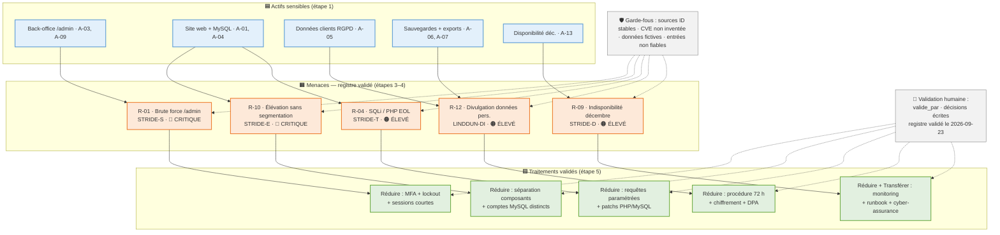

# Synthèse finale — Analyse de risques « ShoPix » (2026-09-23)

> **Statut : registre validé par l'analyste le 2026-09-23** (R-01…R-12, R-14) — R-13 rejeté par décision écrite.
> Produit par l'agent « Synthèse finale » de la chaîne E21, à partir des étapes 1–6 (`00-description.md`…`06-validation.md`, `registre-risques.md`, `registre_risques.json`).
> La synthèse ne contient **aucun élément nouveau** : tout ce qui suit provient du registre validé.

---

## 1. Résumé exécutif

**ShoPix** est une boutique en ligne TPE (produits imprimés sur commande, PHP 8 sur hébergement mutualisé, ~60 commandes/semaine, pic ×3 en novembre–décembre) qui doit justifier un budget sécurité de **~2 500 €/an** auprès de son dirigeant. L'analyse a été conduite en **STRIDE** (menaces, sur le DFD et les 4 frontières de confiance F1–F4) complété par **LINDDUN** (données personnelles — RGPD), avec **DREAD** pour la priorisation et **CVSS** en attente de la CVE réelle du SDK PayFlow (`CVE-2023-XXXX`, placeholder de l'énoncé). Le registre **validé** compte **13 risques** : **2 critiques** (R-01 brute force `/admin`, R-10 élévation de privilèges sans segmentation), **10 élevés** (R-03, R-04, R-05, R-06, R-07, R-08, R-09, R-11, R-12, R-14) et **1 moyen** (R-02). Le risque **R-13 (non-conformité RGPD) a été rejeté** par l'analyste avec décision écrite consignée, mais l'exposition légale subsistante est tracée. Traitement dominant **réduire**, avec transfert pour R-05 (responsabilité fonds PayFlow) et R-09 (cyber-assurance) ; aucun risque accepté tel quel. Équilibre budgétaire indicatif : **~2 300 €/an** sur les 2 500 € demandés. Suivi : **revue semestrielle (prochaine : mars 2027)** + revue rapide **avant novembre**, avec déclencheurs de ré-analyse actés (incident, changement de périmètre, CVE PayFlow réelle via `composer audit`, évolution RGPD → ré-ouvre R-13).

## 2. Top risques prioritaires

| Rang | ID | Niveau | Pourquoi il est prioritaire |
|---|---|---|---|
| 1 | **R-01** — Brute force `/admin` (STRIDE-S) | 🔴 **Critique** | Déjà observé en 2024 (~1 000 tentatives/24 h) sans lockout ni MFA, sessions de 30 jours : l'accès admin total n'est **qu'une question de temps**. Compromission du compte « Mélanie » (droits totaux) = compromission produits, commandes, clients, exports. Rang DREAD 2 (7,6). |
| 2 | **R-10** — Élévation de privilèges sans segmentation (STRIDE-E) | 🔴 **Critique** | Site = API = back-office = MySQL = fichiers sur **la même VM**, un seul compte `shopix` à pleins droits : une compromission web initiale (`ATT&CK-T1190`) vaut **compromission totale du système**. Rang DREAD 1 (8,8) — le risque le plus dommageable. |
| 3 | **R-04** — SQLi / exploitation PHP 8.0 EOL (STRIDE-T) | 🟠 Élevé | Application exposée sur Internet, PHP et MySQL en fin de vie, **aucune mention de requêtes préparées**, pas de WAF, un compte DB à pleins droits : l'injection donne lecture/écriture sur le catalogue, les commandes et les comptes — porte d'entrée de R-10 et R-12. Rang DREAD 3 (7,6). |
| 4 | **R-09** — Indisponibilité en décembre (STRIDE-D) | 🟠 Élevé | Aucun monitoring/WAF/CDN sur VM mutualisée, pic ×3 : le CA de novembre–décembre (~1 500 €/semaine en pic) est **définitivement perdu** s'il n'est pas réalisé. Unique risque transféré vers une cyber-assurance en plus des mesures de réduction. Rang DREAD relativement bas (7,0) mais impact métier maximal pour une TPE de cette taille. |
| 5 | **R-12** — Divulgation en masse des données personnelles (LINDDUN-DI) | 🟠 Élevé | Toute compromission (R-04, R-08, R-10) expose le **fichier clients complet** (nom, e-mail, adresse, tél., historique, hash SHA-1) de citoyens européens, avec notification 72 h **non préparée** (art. 33 RGPD) : préjudice aux personnes + sanction, sur l'actif de plus grande valeur informationnelle (A-05). |

> À surveiller aussi : **R-02** (moyen mais DREAD 7,4, hash SHA-1 obsolète) et **R-05** (rang DREAD 6,2 mais CVE en attente de confirmation — ré-évaluer dès `composer audit`).

## 3. Décisions à noter (issues de `06-validation.md`)

| Décision | Détail | Responsable · Date |
|---|---|---|
| **Traitements retenus** | **Réduire** partout (dominant), + **Transférer** pour **R-05** (responsabilité des fonds vers PayFlow via DPA) et **R-09** (cyber-assurance perte d'exploitation). **Aucun « éviter », aucun « accepter »** — tous les risques retenus ont un résiduel acté. | Analyste · 2026-09-23 |
| **R-13 rejeté** | La non-conformité RGPD **n'est pas retenue** au registre validé (décision écrite consignée). ⚠️ Traçabilité : l'exposition légale subsiste tant que les traitements ne sont pas conformes ; **ré-analyse automatique si plainte / contrôle CNIL / évolution réglementaire**. | Analyste · 2026-09-23 |
| **R-14 modifié** | Directive analyste : probabilité inchangée (Moyenne), impact **Moyen → Élevé** (perte définitive de commandes + données clients, incident réel de 2025), niveau **Moyen → Élevé**, résiduel **Faible → Moyen** (conservateur). Modifiable à la prochaine revue. | Analyste · 2026-09-23 |
| **Risques résiduels acceptés** | Les résiduels de R-01…R-12 et R-14 (tableau du registre) sont **acceptés** — aucun n'est nul, tous sont actés. | Admin « Mélanie » (accompagnement prestataire au besoin) · 2026-09-23 |

## 4. Recommandations actionnables

Chaque action remonte à un risque du registre validé (le « pourquoi »). Les échéances renvoient au plan de suivi `06-validation.md` § 3 (revue semestrielle mars 2027 + revue avant novembre).

| # | Action | Pourquoi (lié au registre) | Priorité | Effort | Prochaine revue |
|---|---|---|---|---|---|
| A1 | Déployer **MFA + verrouillage de compte (5 échecs) + sessions courtes** sur `/admin` | R-01 (critique) : le brute force observé en 2024 n'a **aucun** obstacle — MFA et lockout cassent la boucle attaque. | ★★★ Critique | Faible | **Nov. 2026** |
| A2 | **Séparer les composants** (isolation hébergeur/VPS) + **comptes MySQL distincts par application** + ré-audit | R-10 (critique) : sans cloisonnement, la compromission du site public = compromission totale (risque n° 1 en DREAD, 8,8). | ★★★ Critique | Moyen | **Nov. 2026** |
| A3 | **Requêtes paramétrées** systématiques, **patchs PHP/MySQL** (fin de vie), bascule du compte `shopix` en moindre privilège | R-04 (élevé) : ferme la porte d'entrée SQLi/exploitation EOL qui alimente R-10 et R-12. | ★★ Haute | Moyen | **Nov. 2026** |
| A4 | Lancer **`composer audit`**, patcher le SDK PayFlow dès CVE confirmée, **vérifier la signature des webhooks** `payment.ok`, signer un **DPA** avec PayFlow | R-05 (élevé) : la vulnérabilité du SDK est **inconnue tant que `composer audit` n'a pas tourné** ; chaque semaine sans audit = semaine sans visibilité sur le flux de paiement. | ★★ Haute | Faible | **Dès confirmation CVE** puis Nov. 2026 |
| A5 | Mettre en place **monitoring + alertes**, protection de base (rate-limiting/CDN si hébergeur), **runbook de rétablissement**, souscrire la **cyber-assurance** | R-09 (élevé) : la période de fêtes est **irrattrapable** ; le transfert financier seul ne suffit pas sans monitoring et runbook dimensionnés au pic. | ★★ Haute | Moyen | **Nov. 2026 (avant fêtes)** |
| A6 | **Automatiser la sauvegarde (cron)** + **test de restauration mensuel** + règle 3-2-1 | R-14 (élevé depuis 2026-09-23) : l'incident de 2025 a prouvé qu'une sauvegarde manuelle oubliée = **perte définitive** de commandes et de données clients. | ★★ Haute | Faible | **Nov. 2026** |
| A7 | **Rotation immédiate de la clé PayFlow exposée**, `.gitignore` + secret scanning, gestionnaire de secrets | R-07 (élevé) : la clé a déjà fuité 1 mois sur GitHub (2024) sans rotation — un accès au dépôt = paiements frauduleux. | ★★ Haute | Faible | Nov. 2026 |
| A8 | **Chiffrer les dumps** SQL avant transfert, sauvegarder **hors du serveur mutualisé**, FTP restreint | R-08 (élevé) : le dump en clair déposé chez le même hébergeur (isolation F4 non vérifiable) expose tout le fichier clients à un tiers de la machine. | ★ Moyenne | Moyen | Mars 2027 |
| A9 | **Journalisation horodatée** des actions admin (logs en écriture seule) + revue périodique | R-06 (élevé) : aucune trace aujourd'hui = aucune preuve exploitable pour un litige, une enquête ou une réclamation RGPD. | ★ Moyenne | Faible | Mars 2027 |
| A10 | **Pseudonymiser / minimiser** les exports `.csv`, réduire la conservation (24 mois → minimum) | R-11 (élevé) : les exports complets non pseudonymisés permettent corrélation et identification (LINDDUN-L/I) et réutilisation du fichier client. | ★ Moyenne | Moyen | Mars 2027 |
| A11 | Préparer la **procédure de notification 72 h** (art. 33), chiffrement, clauses **DPA** hébergeur/prestataires, **droit à l'oubli** automatisé | R-12 (élevé) : la notification de violation **n'existe pas** — sans procédure prête, toute compromission aggrave le préjudice réglementaire. | ★ Moyenne | Moyen | Mars 2027 |
| A12 | **Migrer les hash SHA-1 → bcrypt/argon2**, 2FA clients optionnelle, détection de connexions anormales | R-02 (moyen, DREAD 7,4) : SHA-1 est attaquable hors ligne et présent dans les tables arc-en-ciel — migration à coût faible pour un gain de fond en matière de comptes clients. | ★ Moyenne | Moyen | Mars 2027 |
| A13 | **SPF/DKIM/DMARC** sur le domaine, stockage des clés e-mail hors code, surveiller le domaine + **analyser l'avis de phishing reçu** | R-03 (élevé) : déjà survenu en 2023 (2 jours de spam au nom de la boutique) — l'authentification e-mail et la rotation des clés réduisent l'usurpation d'identité. | ★ Moyenne | Faible | Mars 2027 |

> ⚠️ R-13 (rejeté) ne fait pas l'objet de recommandation volontaire ici ; si la donnée réglementaire évolue (plainte, contrôle CNIL), le déclencheur de ré-analyse acté ré-ouvre son examen — les mesures RGPD sont donc à conserver en réserve.

## 5. Qualité et limites de l'analyse

**Fiabilité de l'existant** — points à consolider à la prochaine revue :

| Limite | Impact | Action de fiabilisation |
|---|---|---|
| **`CVE-2023-XXXX` = placeholder** de l'énoncé (SDK PayFlow) | R-05 non noté en **CVSS v4.0** (anti-hallucination : aucune note fabriquée) | Lancer **`composer audit`** (action A4) → identifier la CVE réelle → poser la note CVSS avec métriques Environnement (exposition Internet, mutualisation, données RGPD) |
| **Mutualisation hébergeur non vérifiable** (frontière F4) | Isolation PHP — menace latérale réelle mais **non démontrée** ; hypothèse conservatrice sur R-08/R-09 | Écrire à l'hébergeur pour obtenir les garanties d'isolation ou migrer (action A2/A8) |
| **Absence d'équipe sécurité** (TPE, 1 admin) | Notes DREAD **subjectives** ; probabilités ancrées uniquement sur les incidents documentés du cas (pas de données de menace externalisées) ; pas de DPO/référent RGPD (lié au rejet de R-13) | Revoir les probabilités à chaque revue ; externaliser un audit ponctuel sur les postes sensibles (A1/A2/A5) |
| **Données d'entrée fictives** | Analyse sur le cas d'étude, pas sur le SI réel | Transposer la méthode à un audit réel avant application |

**Maîtrise de l'IA (garde-fous appliqués, `RAPPORT-CONTROLE.md`)** — les six risques propres aux LLM ont été contrôlés à chaque étape (verdicts OK sur les 6 étapes + mise à jour post-validation) :

- **Hallucination** : chaque affirmation cite une source de `knowledge_base/` (ID stables) ; aucun numéro de CVE inventé (`CVE-2023-XXXX` conservé comme placeholder) ; aucune note CVSS fabriquée.
- **Injection de prompt** : entrées traitées comme données non fiables (encadrées) — aucune instruction parasite dans les sorties.
- **Fuite de données** : données de l'étude de cas **anonymisées/fictives** (ShoPix, « Mélanie »), jamais de donnée réelle envoyée à un service externe.
- **Excès d'autonomie** : agents sans décision — `valide_par` reste **null** jusqu'à la validation humaine ; la modification de R-14 provient d'une directive humaine tracée.
- **Empoisonnement** : base de connaissances versionnée et contrôlée ; 3 techniques ATT&CK proposées (T1110, T1078, T1566) marquées « hors index », non citées comme validées.
- **Dépendance** : sorties Markdown/JSON autonomes (rendu GitHub natif, abstraction LLM interchangeable).

---

## 6. Schéma de synthèse

Actifs sensibles → menaces retenues (niveaux) → traitements, avec garde-fous et validation humaine (conventions `schemas-diagrammes`).

---

*Document prêt à intégrer au dossier de soutenance E21 — registre validé, décisions tracées, actions liées aux risques (R-01…R-12, R-14).*