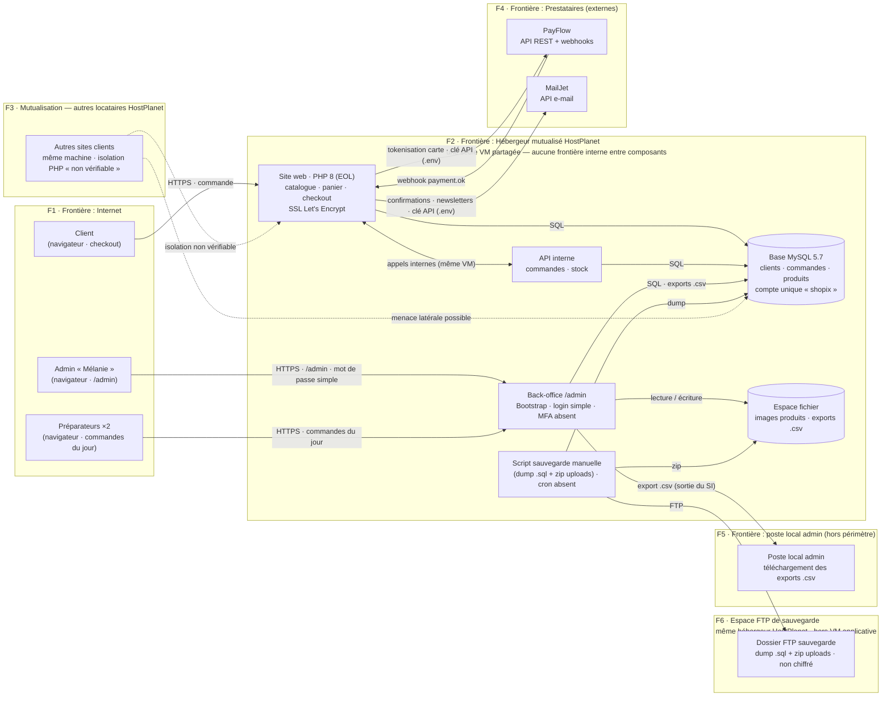

# Étape 1 — Description de l'existant · cas « ShoPix »

> Analyse du **2026-09-24** — chaîne E21, étape 1 (décrire l'existant, identifier les actifs).
> Entrée : `etude-de-cas.md` (cas pilote A — boutique en ligne), sections 1 à 11.
> ⚠️ **Données fictives** : tout ce qui suit provient de l'étude de cas ; aucune donnée réelle ou sensible n'est manipulée.

**Métadonnées**

| Champ | Valeur |
|---|---|
| Dossier d'analyse | `analyses/2026-09-24_boutique-en-ligne/` |
| Cas | A — Boutique en ligne « ShoPix » |
| `donnees_personnelles` | **`true`** (RGPD applicable) |
| Référentiel d'ancrage | `ANSSI-CARTO-SI` (Cartographie du SI — guide d'élaboration en 5 étapes, ANSSI 2018) |
| Format des schémas | skill `schemas-diagrammes` (Mermaid, rendu GitHub) |

---

## 1. Cas étudié

**Le système.** « ShoPix » est une TPE créée en 2021 qui vend des produits imprimés (posters, t-shirts, goodies) sur commande via un site web. Elle réalise ~15 000 € de CA par trimestre, traite ~60 commandes/semaine en moyenne, avec un pic **×3 en novembre–décembre** (période de fêtes). Le site est hébergé en **mutualisé** chez « HostPlanet » (une seule VM partagée), avec deux prestataires : PayFlow (paiement par carte/SEPA, API REST + webhooks) et MailJet (e-mails : confirmations, newsletters). Pas d'équipe technique interne, pas de DPO, pas de monitoring.

**Finalité de l'analyse.** Livrer un **registre des risques priorisé** (actifs, menaces, niveaux, contre-mesures) afin de **justifier auprès du dirigeant un budget sécurité d'environ 2 500 €/an**, puis un plan de remédiation ordonné. Justification économique de ce budget : avec ~15 000 € de CA par trimestre (donnée du cas), une semaine de vente représente **≈ 1 150 € de CA** (15 000 ÷ 13), soit **≈ 3 450 €/semaine en pic de fêtes** (×3) ; une indisponibilité ou un incident en décembre peut donc faire perdre une part significative du CA de la saison (plusieurs dizaines de milliers d'euros si arrêt prolongé), sans compter la sanction RGPD et la perte de réputation.

**Acteurs et rôles.**

| Rôle | Droits | Moyen d'accès |
|---|---|---|
| Client | Commande, suivi, désinscription newsletter | compte optionnel (e-mail + mot de passe) |
| Admin « Mélanie » | Tout (produits, commandes, clients, exports) | mot de passe simple, **pas de MFA**, sessions 30 j |
| Préparateur ×2 | Commandes du jour, marquer « expédiée » | comptes dédiés, mot de passe simple |
| PayFlow | Webhooks « payment.ok » | clé API dans `.env` |
| MailJet | Envoi d'e-mails (confirmations, newsletters) | clé API dans `.env` |
| Hébergeur HostPlanet | VM mutualisée, SSL Let's Encrypt, PHP maintenue | infra côté fournisseur (hors périmètre) |

---

## 2. Lire le SI par les vues (référentiel `ANSSI-CARTO-SI`)

Le guide ANSSI recommande de cartographier le SI en **vues** (et non en simple liste d'actifs), en inventoriant **objets + attributs** (version, exposition, dépendances, besoins de sécurité) avec une **granularité adaptée à la criticité**, et en **marquant la sensibilité** des vues et données. Application au cas ShoPix :

| Vue (ANSSI) | Contenu pour ShoPix | Sections de ce document |
|---|---|---|
| **Vue métier** | Processus d'affaires (vente, préparation, administration, sauvegarde), acteurs, données manipulées et leur sensibilité | § 4 |
| **Vue applicative** | Composants logiciels (site web, API interne, back-office, script de sauvegarde) et flux inter-applicatifs | § 3 (DFD) + `01-actifs.md` A-01…A-03, A-17, A-19 |
| **Vue architecture technique** | Hébergeur mutualisé, VM unique, MySQL, espace fichier, FTP, prestataires, frontières de confiance | § 3 (DFD) + `01-actifs.md` A-15…A-18 |

Granularité : **fine** sur les composants critiques et les données personnelles (base, back-office, secrets) ; **minimale** sur les dépendances hors périmètre (prestataires).

---

## 3. Architecture et flux (DFD + frontières de confiance)

Schéma de type **DFD avec frontières de confiance** (pattern §3 du skill `schemas-diagrammes`) pour le périmètre ShoPix :

**Frontières de confiance identifiées.**

| # | Frontière | Éléments | Points d'attention |
|---|---|---|---|
| F1 | **Internet → Hébergeur** (exposition publique) | Client → site ; admin & préparateurs → `/admin` | HTTPS uniquement ; brute force `/admin` observée en 2024 (~1 000 tentatives/24 h, **aucun lockout**) |
| F2 | **Hébergeur mutualisé — VM partagée** (frontière interne **absente**) | site = API = back-office = MySQL = espace fichier sur la même VM | Compromission d'un composant = compromission de tous ; pas de segmentation possible sur hébergement mutualisé |
| F3 | **Mutualisation** (autres locataires HostPlanet) | Autres sites sur la même machine | Isolation PHP « non vérifiable » ; menace latérale réelle mais non démontrable |
| F4 | **Hébergeur → Prestataires (externes)** | PayFlow (API + webhooks), MailJet | Clés API en clair dans `.env` ; incidents 2023 (MailJet piraté) et 2024 (clé PayFlow versionnée) |
| F5 | **Sortie vers postes locaux** (hors périmètre) | Exports `.csv` téléchargés « localement » par l'admin | Données confidentielles qui sortent du SI vers un poste non décrit et non maîtrisé |
| F6 | **VM applicative → espace FTP de sauvegarde** | Dossier **du même hébergeur mutualisé** (hors VM applicative) : dump `.sql` + `.zip` | **Non un prestataire** : même zone de confiance hébergeur ; SQL **non chiffré** ; isolation avec la VM non documentée |

**Lecture du DFD.** Le périmètre analysé tient intégralement dans **une** VM mutualisée : la frontière F2 est une frontière d'*entrée* unique sans défense en profondeur interne. Les flux vers l'extérieur (paiement, e-mail) franchissent F4 avec pour seule protection des **clés API stockées en clair** (A-08) ; la sauvegarde transite en **FTP vers un espace du même hébergeur mutualisé** (F6 — hors prestataires) et n'est pas chiffrée (A-07). Le poste local de l'admin fait sortir les exports `.csv` du SI (F5, hors périmètre).

---

## 4. Vue métier — processus et sensibilité

| Processus métier | Acteurs | Données manipulées | Sensibilité de la vue |
|---|---|---|---|
| Vente en ligne (catalogue → panier → checkout → paiement → commande) | Client, PayFlow, MailJet, système | Données client, commande, jeton de paiement (jamais la carte) | **Critique** (disponibilité) + **confidentiel** (RGPD) |
| Préparation / expédition | Préparateurs ×2 | Commandes du jour | Interne |
| Administration catalogue & clients | Admin « Mélanie » | Produits, clients, **exports `.csv` complets** | **Confidentiel (RGPD)** |
| Sauvegarde hebdomadaire | Admin (manuel, cron absent) | `.sql` complet + `.zip` des uploads, **non chiffrés** | **Critique** (intégrité / disponibilité) |

---

## 5. Contexte métier et contraintes

- **RGPD — données personnelles OUI** (`donnees_personnelles: true`) : données clients européennes (nom, e-mail, adresse, téléphone, historique, mot de passe hashé `sha1` — ancien, consentement newsletter). État non conforme : pas de DPO, registre absent, mentions légales incomplètes, droit à l'oubli non automatisé, cases de consentement « mal enregistrées », exports `.csv` non pseudonymisés conservés 24 mois → **exigence réglementaire**, risque de sanction (plafond légal art. 83 RGPD : 20 M€ ou 4 % du CA mondial, proportionné à la taille de l'entreprise) + notification de violation 72 h (art. 33).
- **PCI DSS** : cartes **jamais stockées** (tokenisation côté PayFlow) → **hors périmètre serveur** ; toutefois le checkout embarque des pages de paiement → surface de conformité du site à surveiller.
- **Contraintes hébergeur mutualisé** : pas de root, pare-feu non configurable, PHP version gérée par l'hébergeur, isolation non vérifiable.
- **Dettes techniques / dépendances versionnées** (étude de cas §9) : PHP 8.0 (EOL), MySQL 5.7, PayFlow-SDK 2.1 (**CVE-2023-XXXX connue, non patché**), plugin impressions 3.2.1 (non audité), `composer audit` jamais lancé.
- **Budget** : ~2 500 €/an à justifier ; impératif de rester concurrentiel côté prix ; pas d'équipe technique interne (prestataire au besoin).
- **Règles affaires** : disponibilité **critique en décembre** (perte de CA directe et définitive) ; réputation **fragile** (petite entreprise, déjà 1 avis de phishing abandonné non analysé).

---

## 6. Périmètre de l'analyse

| Inclus | Exclus (frontières de confiance tracées) |
|---|---|
| Site web public, back-office, API interne, base de données, flux paiement côté boutique, e-mails, sauvegardes, comptes admin/préparateurs, nom de domaine | Infrastructure **PayFlow**, **MailJet**, **hébergeur** (côté fournisseurs), **postes clients**, poste local de l'admin (sortie `.csv`, F5) |

Sont exclues du périmètre d'analyse les cartes bancaires elles-mêmes (tokenisées chez PayFlow) et la conformité PCI DSS du côté de PayFlow.

---

## 7. Champ de décision pour les étapes suivantes

- `donnees_personnelles` : **`true`** → l'étape 2 devra justifier **STRIDE** comme grille principale (application web décrite par DFD) et prévoir **LINDDUN** en complément pour la vie privée (RGPD).
- 19 actifs inventoriés avec valeur et sensibilité (cf. `01-actifs.md`).
- Les frontières **F1–F6** définissent les zones où chercher les menaces (étape 3) : expositions publiques (F1/F2), saut de mutualisation (F3), secrets vers prestataires (F4), exfiltration vers postes (F5), espace FTP de sauvegarde du même hébergeur (F6).

---

## 8. Sources

- `ANSSI-CARTO-SI` — *Cartographie du système d'information — Guide d'élaboration en 5 étapes* (ANSSI, 2018). [base de connaissances `knowledge_base/README.md`]
- `etude-de-cas.md` — cas pilote « ShoPix », sections 1 à 11 (architecture, acteurs, données, flux, incidents, exigences, dépendances, périmètre).
- Skill `schemas-diagrammes` — pattern §3 (DFD + frontières de confiance en Mermaid).
- Skill `analyse-risques` — étape 1 de la méthode en 6 étapes.
- RGPD (art. 33 et 83) — référence réglementaire du contexte métier (mention textuelle, hors index des sources de contre-mesures).