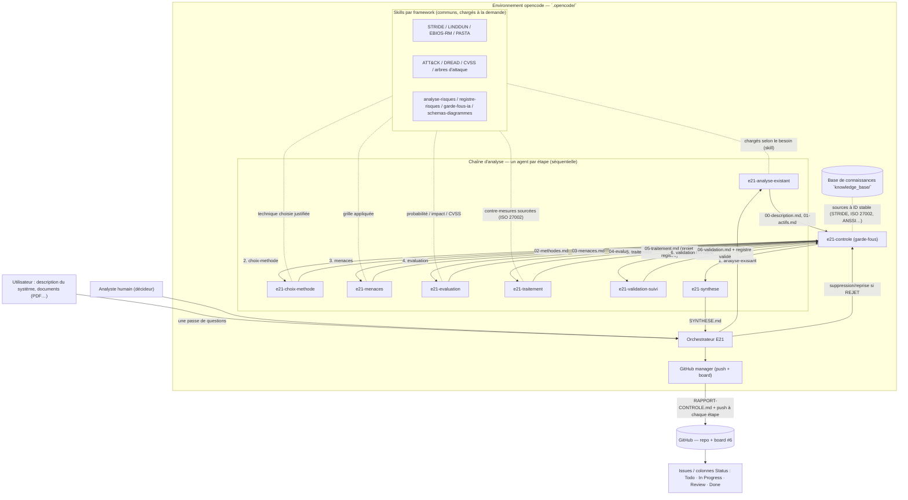

# 01 — Architecture

Système multi-agents IA **intégré à l'environnement opencode** (pas de site web) qui assiste un analyste dans l'analyse de risques d'un système informatique. L'humain reste décideur final. Toutes les sorties sont des documents `.md`/`.json` créés dans un dossier dédié par analyse, **poussés régulièrement sur GitHub** et suivis sur le board.

## Vue globale



## Principauté d'exécution

1. **Collecte en une passe** : l'orchestrateur pose toutes les questions (cas, description, flux, contraintes RGPD, documents, préférence de méthode) dans un seul échange `question`.
2. **Chaîne séquentielle** : chaque agent produit un `.md`/`.json` dans `analyses/<AAAA-MM-JJ>_<cas>/`, contrôlé par `e21-controle` avant push.
3. **Humain dans la boucle** : `e21-validation-suivi` fait relire/valider chaque risque (champ `valide_par`) ; aucun registre n'est final sans validation.
4. **Traçabilité** : push régulier de la branche `analyses/…`, commentaires d'issue + board mis à jour par `github-manager`.

## Agents (`.opencode/agents/`)

| Agent | Mode | Rôle | Sortie |
|---|---|---|---|
| `orchestrator` | agent | Collecte, lance la chaîne, propage les reprises | dossier + suivi |
| `e21-analyse-existant` | subagent | Décrit le système (DFD, frontières de confiance), inventorie les actifs | `00-description.md`, `01-actifs.md` |
| `e21-choix-methode` | subagent | Expert des méthodes ; compare et choisit la grille avec justification | `02-methodes.md` |
| `e21-menaces` | subagent | Applique la grille, enrichit ATT&CK/CVE | `03-menaces.md` |
| `e21-evaluation` | subagent | Probabilité × impact = niveau, priorisation DREAD/CVSS | `04-evaluation.md` |
| `e21-traitement` | subagent | Réponse + contre-mesures sourcées + risque résiduel | `05-traitement.md` |
| `e21-validation-suivi` | subagent | Validation humaine, décisions, plan de suivi | `06-validation.md`, `registre-risques.md` |
| `e21-synthese` | subagent | Reprend tout, recommande en expliquant pourquoi | `SYNTHESE.md` |
| `e21-controle` | subagent | Garde-fous qualité : sources, injection, fuite, format | `RAPPORT-CONTROLE.md` |
| `github-manager`, `research`, `security` | subagent | Support : board/PR, veille/knowledge_base, audit | — |

Modes et permissions : `orchestrator` dispose des outils de workflow (`question`, `task`) ; les agents de chaîne sont en **lecture seule partout sauf `analyses/**`** (règle `edit: deny "**"` puis `allow "analyses/**"` — la dernière règle gagnante l'emporte), `bash` refusé ; `e21-controle` est entièrement **lecture seule** (il n'écrit que son `RAPPORT-CONTROLE.md` via l'orchestrateur) ; `github-manager` seul gère repo/board.

## Skills (`.opencode/skills/<nom>/SKILL.md`)

| Skill | Usage |
|---|---|
| `project-context` | Contexte obligatoire en début de toute session |
| `analyse-risques` | Les 6 étapes E21 + matrice 4 traitements |
| `registre-risques` | Format de sortie (tableau + JSON + `valide_par`) |
| `garde-fous-ia` | Les 6 risques IA (hallucination, injection, fuite, excès d'autonomie, empoisonnement, dépendance) |
| `schemas-diagrammes` | Conventions Mermaid (diagrammes propres et homogènes) |
| `ebios-rm`, `stride`, `linddun`, `pasta`, `mitre-attack`, `dread`, `cvss` | Grilles de menaces / notation |
| `git-workflow`, `machine-state`, `new-project` | Support (template, allégé) |

## Base de connaissances et sources

Chaque menace / contre-mesure / niveau cite une **source à identifiant stable** (`knowledge_base/`, ré-indexée en **ISO/IEC 27002:2022 canonique** le 24/09) : `STRIDE-S`, `ISO27002-8.8`, `EBIOS-RM-2018`, CVE via NVD. Ce point est vérifié par `e21-controle` (et par l'invariant **T-10** de la suite de tests, qui refuse tout code `ISO27002-A*` legacy).

## Modèle LLM — état réel (mis à jour le 24/09/2026)

**Le système est un POC piloté par consignes** : il n'existe **aucun code applicatif** (ni `LlmProvider`, ni `config.py`, ni script de routage) — le « programme » est l'ensemble des consignes Markdown des agents (`description`, `system`, skills) interprétées par l'environnement opencode.

- Modèle effectivement utilisé pour l'exécution (et pour cette analyse) : **`opencode/big-pickle`** (API cloud). Les consignes interdisent tout envoi de données réelles : le cas pilote n'utilise que des données **fictives**.
- **Roadmap (décision du 24/09)** : passer l'exécution en **local avec ollama** (aucune donnée ne sort du poste) — « solution plus tard », documentée dans `ROADMAP.md` et `CHOIX-MODELES-IA.md`.
- L'abstraction « modèle interchangeable » décrite dans les études amont (ollama / api / mock déterministe) est **un objectif de conception**, pas un composant codé — les documents l'ont depuis corrigé en ce sens (ne pas présenter le contraire en soutenance).

## Structure du dépôt

```
.opencode/
├── agents/                # orchestrator + e21-* + support (github/machine/security…)
├── skills/*/SKILL.md      # skills métier + frameworks + schémas + support
analyses/
└── <AAAA-MM-JJ>_<cas>/    # un dossier par analyse, poussé régulièrement
knowledge_base/            # sources à ID stable (STRIDE, ISO 27002, ANSSI, EBIOS RM…)
documentation/             # sujets PDF + documentation technique et dossier
ROADMAP.md
```

## Positions de sécurité

- Outils **en lecture seule** pour les agents de chaîne (écriture bornée à `analyses/**`), `bash` refusé ; aucun agent ne modifie de système réel.
- Chaque sortie intermédiaire est **vérifiée** (`e21-controle`, en lecture seule), **journalisée** et **poussée**.
- Garde-fous appliqués à tous les agents (cf. `04-garde-fous.md` et skill `garde-fous-ia`).