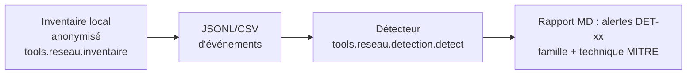

# Détection amont — mapping menaces → signaux → règles (homelab)
> Document généré à partir de `tools/reseau/detection/regles/regles-detection.json` (chantier #29). Analogue partielle : les règles restent à tester/appliquer selon l'infrastructure réelle de l'utilisateur (homelab).
## Garde-fous
- **Tout reste local** : inventaire (`tools.reseau.inventaire`) et détection (`tools.reseau.detection.detect`) ne lisent que des fichiers locaux — aucun socket sortant, aucune donnée réelle (IP/MAC/hostname) n'est écrite dans ce dépôt public (rapport anonymisé seul).
- Les événements analysés sont **déjà anonymisés** (fixtures dans `tools/reseau/tests/fixtures/`).
## Flux

## Table de mapping (famille → menaces E21 → MITRE ATT&CK → signaux → règle)
| Règle | Famille | Techniques MITRE | Signaux clés |
|---|---|---|---|
| DET-01 | scan / repérage | T1046 Network Service Discovery | N destinations distinctes touchées en moins de T secondes depuis une même source; sweep de ports sur une plage d'hôtes |
| DET-02 | scan / repérage | T1046 Network Service Discovery | plus de N ports différents closed/filtrés sur un même hôte en moins de T secondes |
| DET-03 | compromission de compte | T1110 Brute Force, T1110.001 Password Guessing | N tentatives SSH échouées en T secondes sur un même compte; aucun déverrouillage ni limitation de débit côté serveur |
| DET-04 | compromission de compte | T1078 Valid Accounts, T1110.004 Credential Stuffing | même compte en échec depuis N adresses IP différentes en moins de T secondes; aucune MFA (le registre note 2FA clients absents) |
| DET-05 | accès web anormal | T1190 Exploit Public-Facing Application | pages d'erreur répétées sur un même chemin sensible (setup, admin, API); absence de WAF / de limitation de débit (constat R-04, R-09) |
| DET-06 | déni de service | T1498 Network Denial of Service, T1499 Endpoint Denial of Service | N requêtes (429/500/timeout) en moins de T secondes sur la même ressource; absence de CDN / rate-limiting / monitoring (constat R-09) |
| DET-07 | exfiltration | T1567 Exfiltration Over Web Service, T1041 Exfiltration Over C2 Channel | taille de téléchargement > seuil (octets) vers une destination hors périmètre; export massif (fichier .csv/.sql) généré ou copié hors des sauvegardes planifiées |
| DET-08 | exfiltration | T1567.002 Exfiltration to Cloud Storage | connexion sortante vers IP inconnue en dehors des plages autorisées; destination jamais vue dans l'inventaire (allowlist = 203.0.113.0/24 partenaires/CDN) |
| DET-09 | mouvement latéral | T1021 Remote Services, T1078 Valid Accounts | ouverture de session sur un compte à privilèges; puis connexion d'administration (RDP/WinRM/SSH) vers une autre machine, depuis la même source, dans la fenêtre |
| DET-10 | présence persistante | T1053 Scheduled Task/Job | tâche cron/at qui télécharge puis exécute un script distant (curl|sh); commande planifiée écrivant dans un répertoire d'exécution |
| DET-11 | présence persistante | T1136 Create Account | création de compte ou élévation de privilèges en dehors des fenêtres de service; compte créé sur un serveur applicatif plutôt que sur un serveur d'identités |
| DET-12 | conteneurs risqués | T1611 Escape to Host, T1610 Deploy Container | image exécutée avec --privileged ou --net=host; montage de /var/run/docker.sock ou du dossier hôte en_rw |
## Règle de correspondance avec le registre de risques
Chaque famille de ce mapping couvre des menaces des étapes 3-4 de la chaîne E21 (STRIDE / EBIOS / LINDDUN selon le cas) ; les couples famille↔menaces sont détaillés dans le champ `menaces` de chaque règle (voir `regles-detection.json`).
