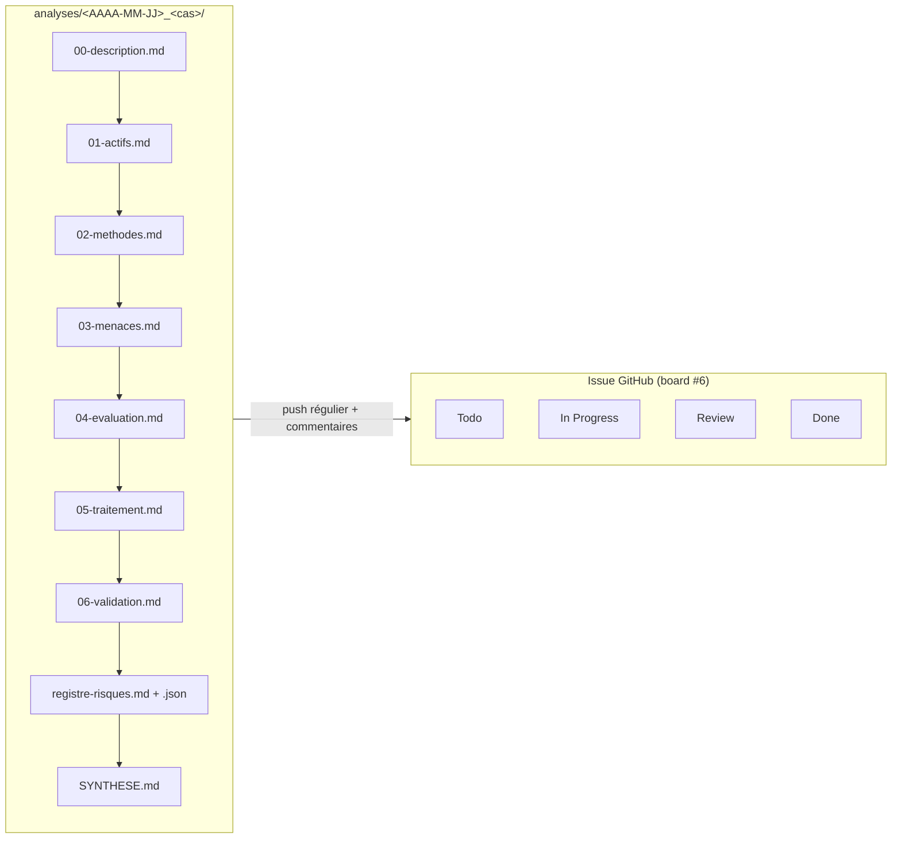

# Documentation technique — E21 « Des agents IA pour analyser les risques »

Documentation de conception et d'implémentation du prototype. Base : sujet E21 et support CISSP Partie 1 (`documentation/*.pdf`). Le prototype **est l'environnement opencode** (agents + skills, pas de site web).

## Documents

| Doc | Contenu |
|---|---|
| `01-architecture.md` | Architecture globale, orchestration, schémas Mermaid |
| `02-agents.md` | Fiche et consigne de chaque agent de la chaîne |
| `03-format-echanges.md` | Schémas JSON des échanges + dossier d'analyse |
| `04-garde-fous.md` | Sécurité du système : injections, fuite, hallucination, excès d'autonomie… |
| `05-cas-et-modele.md` | Choix du cas d'étude et du modèle de menaces (justifié) |
| `06-plan-de-test.md` | Comparatif analyse manuelle, test d'injection, checklist de rendu |

## Structure d'une analyse

## Conventions

- Échanges **structurés** (`.md` + JSON) conformes au format du sujet (`id, actif, menace, categorie, probabilite, impact, niveau, traitement, mesures, sources, valide_par`).
- Tout risque doit **citer une source** de `knowledge_base/` (ID stable).
- `valide_par` reste vide tant qu'un humain n'a pas validé.
- Un dossier par analyse, poussé régulièrement, suivi sur le board.