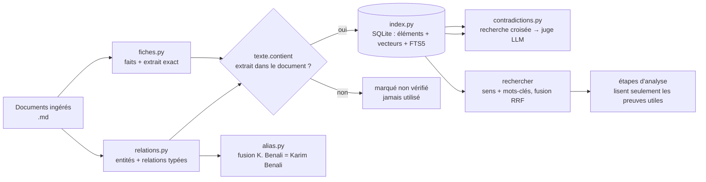

# `tools/connaissance` — le dossier de connaissance E21

> **Statut : branché** sur le site (page « Connaissances », lancement automatique au dépôt de documents) et sur la chaîne
> (dossier de preuves par étape, citations vérifiées, propagation des décisions). Voir « Branchement réalisé » en bas.

## À quoi ça sert

Les agents d'analyse lisaient **tous les documents à chaque étape** : le contexte déborde, le modèle oublie ou
invente. Ce paquet fait le travail **une seule fois par document** et le garde :

1. **séparer** l'information de chaque document en faits atomiques, chacun avec **l'extrait exact** qui le prouve ;
2. **relier** ces faits (entités, relations typées, fusion des alias, contradictions entre documents) ;
3. **retrouver** vite ce dont une étape a besoin (recherche par sens + par mots-clés), sans tout relire.

Règle directrice : **un fait n'entre dans l'index que si son extrait existe mot pour mot dans le document** —
vérification faite par le code (`texte.contient`), jamais par un modèle.

## Schéma



## Les modules (un rôle chacun, remplaçables séparément)

| Module | Rôle | Dépend d'un modèle ? |
|---|---|---|
| `texte.py` | normaliser, vérifier un extrait, présence d'un nom | **non** (déterministe) |
| `ollama.py` | client Ollama : discuter (JSON contraint), vecteurs, cosinus | — |
| `fiches.py` | faits atomiques d'un document (`Fait.verifie`) | oui (extraction) |
| `relations.py` | entités et relations typées (`Relation.verifiee`) | oui (extraction) |
| `alias.py` | fusion des noms qui désignent la même chose | non (règles) + vecteurs |
| `contradictions.py` | `croiser` : chaque fait face aux passages des AUTRES documents → signalements | oui (juge) sur un fait + 4 passages |
| `index.py` | SQLite : stockage + recherche hybride + cycle de vie des documents | non |
| `ingestion.py` | mise à jour INCRÉMENTALE (nouveau / modifié / retiré, par empreinte) : faits, alias, croisement, couverture | via les moteurs injectés |
| `travail.py` | tâche de fond d'un projet : `etat.json`, un seul travail à la fois, reprise après interruption | — |
| `preuves.py` | dossier de preuves d'une étape (`[E12]`) que les agents lisent à la place des documents | vecteurs des questions |
| `citations.py` | contrôle des citations : identifiant existant (code), ligne soutenue (2 vérificateurs), affichage en notes | oui (vérification) |
| `externe.py` | recherche hors documents (`origine = externe`), extrait exact + 2 vérificateurs, jamais mêlée aux documents | oui |
| `experience.py` | mesure la qualité de bout en bout sur un dossier | — |

## Ce qui a été mesuré (Nordval : 22 documents, 38 Ko, RTX 5070)

| Mesure | Résultat |
|---|---|
| Extraction (faits + relations, 22 documents) | 7 min 40 s |
| Faits dont l'extrait est retrouvé mot pour mot | **240 / 258 (93 %)** |
| Relations vérifiées (extrait + 2 entités présentes) | **212 / 282 (75 %)**, les 22 documents couverts |
| Recherche, rappel@5 (30 questions) | **86 %** hybride ou mots-clés seuls, 83 % vecteurs seuls ; @1 : 63 / 66 / 53 % |
| Contradictions, méthode « paires proches » | **0** trouvée → méthode écartée (gardée pour comparaison) |
| Contradictions, **recherche croisée** (`croiser`) | **71 signalements**, la plupart des incohérences majeures (PSSI vs audit, COMEX vs README, PRA vs budget…) ; ~60 % de précision → toujours validées par un humain |
| Fusion des alias | **à refaire** : 465 noms → 140 entités, mais des fusions abusives (ex. « LogiSoft » avec « M. Dubreuil » et « M365 ») |

Limites : un seul jeu de documents, un seul passage, étiquettes relues à la main sur un échantillon.

## Points faibles connus (par ordre de priorité)

1. **`alias.fusionner` sur-fusionne** : le type « autre » sert de pont, les vecteurs de noms courts sont trop proches
   et la fusion est transitive. À durcir (pas de pont, seuil vecteur plus haut ET recouvrement de mots, vérification
   par paires) et à mesurer sur un jeu relu à la main.
2. **Faux positifs des contradictions** (≈ 40 %) : à réduire par un second avis (MiniCheck) et par des marqueurs de
   conflit ; la liste finale reste à valider par un humain (« nécessite une validation humaine »).
3. **Rappel de la recherche à k=1** (63 %) : prévoir k=8 pour les agents, puis un reclassement des résultats.

## Changer une pièce

- **Autre modèle d'extraction** : constante `MODELE_EXTRACTION` de `fiches.py` / `relations.py`.
- **Autres types de relations** : tuples `TYPES_RELATION` / `TYPES_ENTITE` de `relations.py` (le schéma JSON en dérive).
- **Autre vérificateur de contradictions** : `contradictions.juger`, seule fonction qui parle à un modèle.
- **Autre stockage** (PostgreSQL, graphe…) : réimplémenter `Index` ; l'interface (`ajouter_*`, `rechercher`) suffit.
- **Autre outil de graphe** (ex. Graphify) : peut s'ajouter en lecture comme carte des documents ; il ne remplace pas
  les extraits vérifiés (sa provenance s'arrête au fichier).

## Lancer

```bash
python3 tools/connaissance/tests/test_connaissance.py            # tests, sans réseau ni modèle
OLLAMA_ENDPOINT=http://<pc-gpu>:11434 \
  python3 -m tools.connaissance.experience <dossier_intrants> --base connaissance.sqlite
sqlite3 connaissance.sqlite "SELECT genre, doc, libelle FROM elements LIMIT 10;"   # tout est inspectable
```

## Modèles utilisés (mesurés sur RTX 5070 12 Go)

`qwen3.5:9b` extrait (rapide, JSON contraint) · `gemma4:12b` juge les contradictions et vérifie ·
`bespoke-minicheck` second avis de vérification · `nomic-embed-text` vecteurs.

## Branchement réalisé

1. **Ingestion** : au dépôt de documents, le site lance `travail` en arrière-plan ; seuls les documents nouveaux ou modifiés sont retraités (empreinte), un document retiré emporte ses preuves, un document en erreur est réessayé.
2. **Les agents lisent des preuves** : avant chaque étape, le pilote (`web/chaine.py`) écrit `connaissance/preuves-etape-N.md` (≈ 14 Ko) et le joint à la place des documents. Sans Ollama ou en cas d'échec : lecture directe des documents, comme avant.
3. **Citations** : les agents citent `[E12]` ; le code rejette les identifiants inexistants et les lignes non soutenues, les lignes en doute vont à la validation humaine ; le site affiche des notes discrètes (infobulle = extrait).
4. **Propagation** (`web/propagation.py`) : après validation, seules les lignes liées à un risque modifié sont réécrites, contrôlées par le code, tracées dans `PROPAGATION.md`.
5. **Livrables dans le site** : « Recherches, contradictions et questions ouvertes », rapport de contrôle numéroté, propagation.
6. **Hors documents** : bouton « Chercher hors des documents » si `E21_RECHERCHE_URL` (SearXNG) est configuré ; `origine = externe`, toujours à valider.

```bash
make test-connaissance        # 4 fichiers de tests, aucun modèle contacté
python -m tools.connaissance.travail analyses/<projet>            # mise à jour d'un projet
python -m tools.connaissance.travail analyses/<projet> --complet  # refait tout le croisement
```
